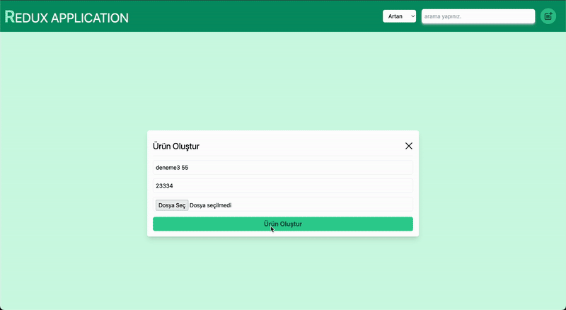
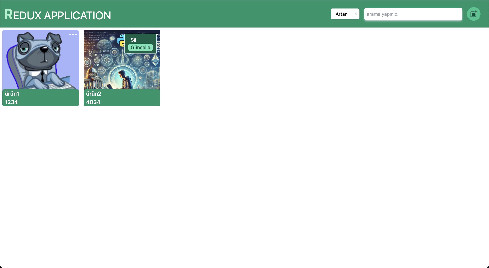
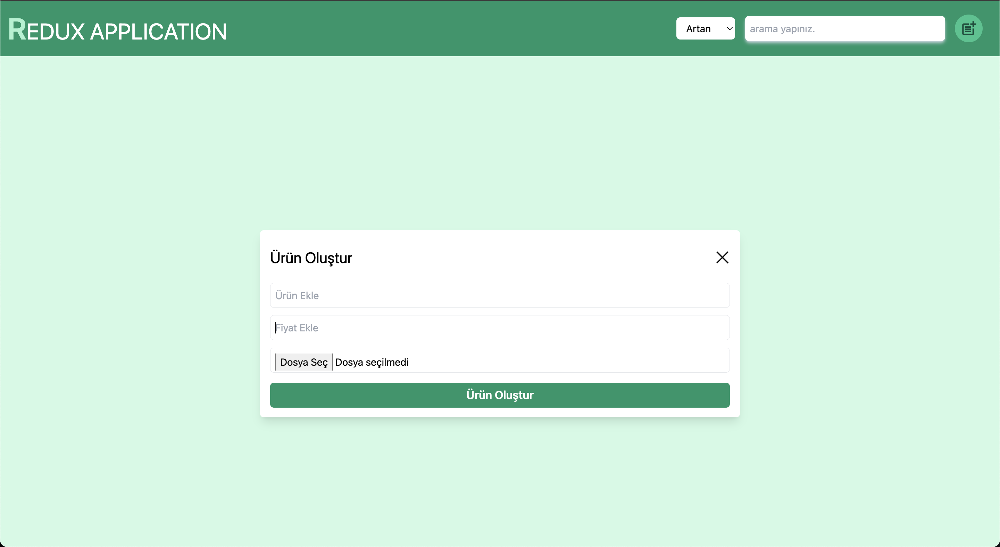

# React Redux Appliacation

This project is a product management application built using React, Vite, and Redux Toolkit. The app provides a simple interface where users can add, delete, update, search, and sort products. It is styled with TailwindCSS and uses React Router DOM for page routing.

## Screenshots 🖼️

### Video GIF



### Mainpage



### Modal



## Features

- **Add Products:** Users can add new products.
- **Delete Products:** Users can delete existing products.
- **Update Products:** Users can update product details.
- **Search Products:** Users can search for products.
- **Sort Products:** Products can be sorted based on specific criteria (e.g., alphabetical or price).
- **User-Friendly Interface:** The application provides an intuitive and modern user interface.
- **React Router:** Page routing is handled using React Router DOM.
- **TailwindCSS:** TailwindCSS is used for responsive and modern design.
- **React-Icons:** React Icons is used for icons throughout the app.

## **Project Setup**

## Installation

1. Clone the repository:
   ```
   git clone https://github.com/ozerbaykal/react-redux-app.git
   cd react-redux-app
   ```
2. Install dependencies:

```
npm install

```

3. Run the development server:

```
npm run dev

```

## Contributing

Contributions are welcome! Please open an issue first to discuss what you would like to change.

- 1.Fork the project
- 2.Create your feature branch (git checkout -b feature/NewFeature)
- 3.Commit your changes (git commit -m 'Add new feature')
- 4.Push to the branch (git push origin feature/NewFeature)
- 5.Open a Pull Request

## Contact 📬

**Özer BAYKAL**  
Email: [baykalozer87@gmail.com](mailto:baykalozer87@gmail.com)  
Project Link: [Movie App on GitHub](https://github.com/ozerbaykal/react-redux-app)
